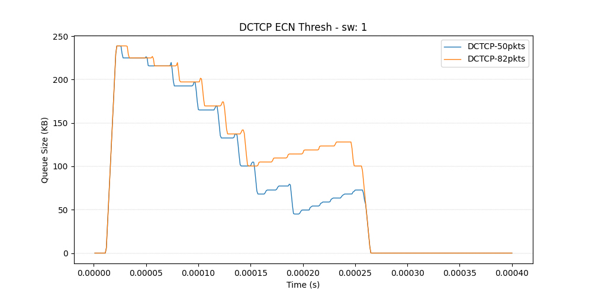
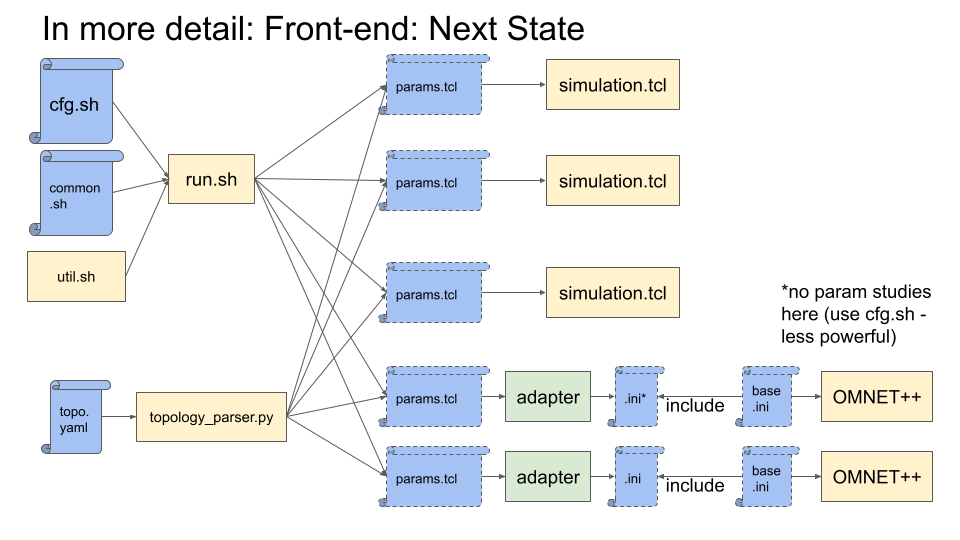

# nwsim
Network simulation using ns-2

/ns2.34 includes pfabric, SIRD, DCTCP, and Homa (ported from https://github.com/PlatformLab/HomaSimulation)

Using version 2.34 as this is the one the [pFabric patch](https://www.cl.cam.ac.uk/research/srg/netos/qjump/nsdi2015/figure9.html) targets. The pFabric patch also fixes issues that would prevent ns-2 from working.

Partially integrated with OMNET (https://github.com/hopnets/vertigo_simulations/tree/master/Omnet_Sims/dc_simulations/src/modules/App) and can support all INET protocols. See below for a sense of how the simulators are integrated.

WARNING: The class PacketQueue of the INET library has been modified.

(some of the) OMNET intergration limitations:
* For manual request target distributions, all hosts must be both "client" and "server" (should not matter in practice)
* For uniform target selection but non uniform client/server placement, the topolgy must have 144 hosts across 9 tors (else must define a new .ned network).
* For more than 144 hosts or more than 16 hosts per tor, a new .ned topology must be created.

## One-script Installation

At the root of the repo
`./setup.sh`

## If One-script Installation fails

Tested on Ubuntu 16.04 and 20.04.
Many of the changes in the code itself that are documented in installation guides are already done.
### Ns-2
#### Dependencies:
```
sudo apt install build-essential autoconf automake libxmu-dev bc
sudo apt install python3-numpy
sudo apt install python3-matplotlib

sudo apt install python3-pip
pip3 install psutil

```
#### gcc 4.8 (for Ubuntu <= 20.04)
```
sudo nano /etc/apt/sources.list
```

Include:
`deb http://in.archive.ubuntu.com/ubuntu bionic main universe`

```
sudo apt update
sudo apt install gcc-4.8 g++-4.8
```
Note: your default gcc version needs to be > 7.0 (`gcc -v`). Version 4.8 is only needed for bulding nam.

#### Environment

Add to PATH:

\<path_to_here\>/nwsim/ns2.34/bin\
\<path_to_here\>/nwsim/ns2.34/tcl8.4.18/unix

Add to LD_LIBRARY_PATH:

\<path_to_here\>/nwsim/ns2.34/otcl-1.13\
\<path_to_here\>/nwsim/ns2.34/lib

Add to TCL_LIBRARY:

\<path_to_here\>/nwsim/ns2.34/tcl8.4.18/library

At the end, your environment variables should look something like this:

```
echo $TCL_LIBRARY
/blah/blah/nwsim/ns2.34/tcl8.4.18/library

echo $LD_LIBRARY_PATH
/blah/blah/nwsim/ns2.34/otcl-1.13:/blah/blah/nwsim/ns2.34/lib

echo $PATH
<bunch_of_stuff>:/blah/blah/nwsim/ns2.34/bin:/blah/blah/nwsim/ns2.34/tcl8.4.18/unix
```

### Installation

#### In ns2.34/ do:
```
./install
```

The common build flow after first installation is:

in ns2.34/ns-2.34 do:

```
./configure --enable-debug     (when Makefile.in changes - with assertions)
make clean && make -j          (every time the source code changes)
```

Good tuto:
http://nile.wpi.edu/NS/

Extra:

[(old) installation insturctions from scratch](https://www.howtoforge.com/tutorial/ns2-network-simulator-on-ubuntu-14.04/)

[For Ubuntu 20.04](https://www.nsnam.com/2020/06/installation-of-ns2-ns-235-in-ubuntu.html)


DCTCP parameter configuration
https://docs.google.com/document/d/1CcboZ8qyhrGq_kS1OLCgqa8YLnb6U17UoAPNZ4U6uWI/edit?usp=sharing

### Omnet++
(original source: https://github.com/hopnets/vertigo_simulations)

## Use

This section gives two examples of running simulations using nwsim and provides key entry points to understanding it.
You may notice that its architecture is sometimes a collection of ad hoc patches (There is an architecture overview later in this doc).
Expect to have to discover functionality by reading the code, both for the simulator itself and its configuration front-end.

You can ignore the other_simulators/ directory.
You can also mostly ignore the ns2.34/ directory until you plan to change the simulator's source code.

### Example of manually creating an incast scenario using DCTCP

#### Key configuration files in scripts/r2p2/coord/config/:
* examples/dctcp-incast.sh: The main experiment configuration file. The file specifies that the same experiment should be run for two values of DCTCP's marking threshold (dctcp_K_l="82 50") and names each simulation appropriately (simulation_name_l='DCTCP-82 DCTCP-50'). When a parameter-sweep like this is described, other parameters can either have the same number of values and be mapped 1-to-1 or can have a single value (eg, dctcp_g_l in example-common.sh) which is used for every simulation run. Only "*_l" parameters can be a list (sketchy, needs love). client_injection_rate_gbps_list (not meaningful here) is an exception: The parameter specifies network load in non-manual workloads and the whole sweep is run for each value of injection rate (see nested loop in `run`).
* examples/example-common.sh: Generic experiment configuration file that sets common parameter values and is meant to be shared across end-files like dctcp-incast.sh to avoid error-prone copy-pasting. Any parameter set in an end-file overwrites that of the imported file. Use this file to set shared default values.
* topologies/4-hosts.yaml: describes the topology of the experiment. Only up to a two-tier leaf-spine topology is supported at the time of writing. This file is specified in variable topology_file_l of dctcp-incast.sh. This topology has 4 hosts connected to the same switch (ToR) with 100Gbps links.
* manual-req-intervals/example-incast.csv: file that explicitly specifies which host sends a flow of a specific size to another host at a specific time. It is specified in variable manual_req_interval_file_l of dctcp-incast.sh. req_interval_distr, req_target_distr, and req_size_distr must be set to manual. See class ManualDistr in other_simulators/common/src/workload-distr.cc to understand the format. In this case, hosts 0, 1, and 2 each send a 1MB flow to host 3 at the same time. The next example will be using random generators instead.

#### Key files you may need to reference in general:
* coord/run: main script that launches and coordinates simulation runs.
* coord/util.sh: reference to understand how parameter lists are handled, specifically "*_l" list parameters (this one needs some love).
* coord/topology_parser.py: reference for problems regarding topology yaml files.
* sim-scripts/r2p2cc/simulation.tcl: the main TCL configuration file that a user would normally tinker with to configure ns-2 simulations. To avoid configuring in an imperative manner using TCL, configuration is done as described above and this file only needs to be changed when adding a new protocol/feature.
* ns2.34/ns-2.34/apps/r2p2-cc/common/generic-app.h/cc: reference to understand how the application layer is configured and how it operates.

#### Running dctcp-incast.sh
```
cd scripts/r2p2/coord/
./run ./config/examples/dctcp-incast.sh 1 1 1 1 0 &> out.txt
```
See variable 'usage' in coord/run for what the options mean (this needs love too).

note: always launch simulations from coord/

note: since a 2-paramter sweep is specified in the config file, `run` will lunch two processes in parallel. Limit the number of concurrent processes by setting parameter max_threads.

To run on a remote server in the background over ssh and be able to disconnect (for long simulations):
```
nohup ./run ./config/examples/dctcp-incast.sh 1 1 1 1 0 &> out.txt &
```
(or use tmux)

The run should complete very quickly. See out.txt for simulation logs (control log verbosity by changing param. global_debug - overwrite example.common.sh's value in dctcp-incast.sh).

##### dctcp-incast.sh Results

Results are placed in a new directory named after the main config file.
In coord/results/dctcp-incast/data, there is now one directory for each simulation run.

Raw output data overview:
* applications_trace.str: logs every flow start and completion. See the traced variables in generic-app.cc -> GenericApp::trace_state()
* qmon/: logs samples of the states of network queues. See variable qmon_cols in post-process/qmon_hlp.py for what each data column is.
* packet_trace.tr: captures every interaction of every packet with every network queue. The file is huge in large simulations and thus is not enabled by default (variable `capture_pkt_trace`). 

This raw data is processed by the python module in post-process/ and the results are place in the experiment's output/ directory.

Processed output data overview:
* app.csv: has various metrics of message slowdown for different msg size groups
* q.csv: has various metrics of queuing at the node level (in KB).
* qlink.csv: same as q.csv but at the link level.
* qhist.csv: has histogram data of queue lengths at the node level. 
* qlinkhist.csv: same but at the link level.
* app/: TODO
* qts/: has CSVs of throughput and queuing timeseries for each network link. There are also plots for said timeseries if the option was selected during launch.

A "quick" way to compare the outputs of different experiments is to use post-process.py/plot_xy.py like so:
```
python3 plot_xy.py 0 2 "DCTCP ECN Thresh" "dctcp-incast" "DCTCP-50pkts,DCTCP-50/60/output/qts/tor/qts_tor_4_host_3.csv" "DCTCP-82pkts,DCTCP-82/60/output/qts/tor/qts_tor_4_host_3.csv"
```

The script will plot the specified time series (queue length at downlink of receiver 3) in the same figure which should look like this. Find the figure in post-process/tmp_plot.



### Example of randomly generated traffic

In this example, traffic is generated randomly.
Flow/message sizes are drawn from a poduction trace (W4, see Homa paper).
Intervals between flows are drawn from the Poisson distribution.
Targets are selected uniformly at random.

Run:
```
./run ./config/examples/generated-traffic.sh 1 1 1 1 0 &> out.txt
```

It should take a couple of minutes to run the simulations and process the results.

#### Config file explanation

generated-traffic.sh describes 6 simulation runs. It runs two configurations of DCTCP and one configuration of SIRD. Each is simulated with 40Gbps and 60Gbps average per-client injection rate (variable client_injection_rate_gbps_list) for a total of 6 runs. Each run generates around 8K flows. You can see high level metrics the latter or goodput injected/achieved in app.csv in the output directory.

Other variables of interest are:
* req_size_distr: the distribution of request sizes. Search for "set-req-sz-dstr" in generic-app.cc. Currently, only requests are drawn from the trace while responses are a fixed few bytes long.
* mean_req_size_B_l: The average size of each request/flow (this should be unecessary in this case but isn't). See W4Distr::W4Distr() in other_simulators/common/src/workload_distr.cc.
* req_interval_distr: The distribution of intervals between request sends. Search for "set-req-dstr" in generic-app.cc.
* req_target_distr: The way clients select target servers. Search for "set-target-distr" in generic-app.cc.
* trace_last_ratio: The ratio of the simulation run that will be measured to extract results. In this example, only the last 20% of simulation time is sampled/traced. This is done to avoid the transient behavior at the beginning of each run and let the system reach stable state. Note that results are only extracted while traffic is injected into the system.  
* trace_cc: Determines whether "under the hood" metrics about the transport protocols will be gathered. In this case, only SIRD is instrumented for this purpose. See output/cc directory in results. See R2p2CCHybrid::trace_state() in r2p2-cc-hybrid.cc to see how it is instrumented and variable cc_cols_hybrid in post-process/cc_hlp.py for the name of each column.
* duration_modifier_l: a knob that determines the duration of the simulation. Set it to get a sufficient number of flows.

## Architecture (may be slightly outdated.)


